# Voice Enabled Task Tracker

A full-stack application for managing tasks with voice command capabilities.

## How it works / System Flow

```mermaid
graph TD
    A["User clicks 'Voice Input'"] --> B["Browser MediaRecorder starts (FREE, INSTANT)"]
    B --> C["User speaks into microphone"]
    C --> D["User clicks 'Stop'"]
    D --> E["Frontend creates audio Blob"]
    E --> F["Frontend sends to YOUR backend"]
    F --> G["Backend → AssemblyAI (transcribe)"]
    G --> H["Backend → Gemini AI (parse)"]
    H --> I["Backend → Frontend (structured task)"]
    I --> J["User reviews and confirms"]
```



## 1. Project Setup

### a. Prerequisites
- **Node.js**: v18+ recommended
- **MongoDB**: Running instance (Local or Atlas)
- **API Keys Required**:
  - AssemblyAI (Voice Transcription)
  - Google Gemini (Text Parsing)

### b. Backend Install & Run
1. Navigate to: `cd backend`
2. Install: `npm install`
3. Configure Environment: Create `.env.local` file
   ```env
   PORT=4000
   MONGODB_URI=mongodb://localhost:27017/tasktracker
   ASSEMBLYAI_API_KEY=your_key_here
   GEMINI_API_KEY=your_key_here
   ```
4. Start Server: `npm run dev`

### c. Frontend Install & Run
1. Navigate to: `cd frontend`
2. Install: `yarn install`
3. Start Dev Server: `yarn dev`
4. Access at: `http://localhost:5173`

## 2. Tech Stack

### Backend
- **Runtime**: Node.js + Express
- **Language**: TypeScript
- **Database**: MongoDB (Mongoose)
- **AI Services**: 
  - **AssemblyAI**: High-accuracy Speech-to-Text
  - **Google Gemini**: Natural Language Understanding (Date/Intent extraction)
- **File Handling**: Multer

### Frontend
- **Framework**: React 19 + Vite
- **Styling**: TailwindCSS v4 + Shadcn UI
- **State Management**: Zustand
- **Drag & Drop**: @dnd-kit (Kanban board)
- **Utilities**: date-fns, axios, lucide-react

## 3. API Documentation

### Task Endpoints
- **GET** `/api/tasks`
  - Fetch all tasks. Supports optional query filters.
- **POST** `/api/tasks`
  - Create a new task.
  - Body: `{ "title": "...", "priority": "High" }`
- **PUT** `/api/tasks/:id`
  - Update task details.
  - Body: `{ "status": "Done" }` or any partial update.
- **DELETE** `/api/tasks/:id`
  - Remove a task permanently.

### AI Endpoints
- **POST** `/api/tasks/parse-voice`
  - Upload an audio file/blob for AI processing.
  - **Body**: `FormData` with key `audio`.
  - **Response**: `{ transcript: "...", parsedTask: { ... } }`
- **POST** `/api/tasks/parse-text`
  - Parse raw text string into structured task data.
  - **Body**: `{ "text": "Fix bug by Friday" }`

## 4. Backend Code Architecture

The backend follows **Clean Architecture** principles to separate concerns and ensure scalability.
* - Reference: [Clean Architecture in Node.js](https://medium.com/@ben.dev.io/clean-architecture-in-node-js-39c3358d46f3)*

### 📂 Directory Structure (`src/`)

#### 1. **Domain Layer** (`/domain`)
*The core business logic. Completely isolated from external libraries (DB, web frameworks).*
- **`/entities`**:
  - `Task.ts`: Defines the Task model with pure business rules (e.g., validation, status changes).
- **`/interfaces`**:
  - `ITaskRepository.ts`: Contract defining how data *should* be saved/retrieved. (Infrastructure implements this).
- **`/usecases`**:
  - `CreateTask.ts`, `UpdateTask.ts`, etc.: Application-specific business rules. Orchestrates data flow between Entities and Repositories.

#### 2. **Infrastructure Layer** (`/infrastructure`)
*Implementations of external tools and database logic.*
- **`/database`**:
  - `TaskRepository.ts`: Implements `ITaskRepository`. Uses Mongoose to talk to MongoDB.
- **`/services`**:
  - `GeminiParserService.ts`: Implements AI parsing logic.
  - `VoiceParsingService.ts`: Handles audio file processing via AssemblyAI.

#### 3. **Interface Adapters** (`/interfaces`)
*Connects the outside world (Web/HTTP) to the Application.*
- **`/controllers`**:
  - `TaskController.ts`: Handles HTTP requests/responses. Calls UseCases.
- **`/routes`**:
  - `taskRoutes.ts`: Defines API endpoints and maps them to Controller methods.
- **`/middleware`**:
  - `upload.ts`: Multer configuration for file uploads.
  - `errorHandler.ts`: Centralized error handling.

#### 4. **Configuration** (`/config`)
- `env.ts`: Centralized environment variable management.

## 5. Frontend Code Architecture

The frontend uses **Atomic Design** principles and **Clean Code** hooks patterns.
* - Reference: [React Patterns](https://www.patterns.dev/react/)*

### 📂 File Guide

#### 1. **Data & State (`/stores`)**
*Global state management using Zustand.*
- **`useTaskStore.ts`**: The "single source of truth" for tasks. managing Create, Read, Update, Delete (CRUD) operations and syncing with the API.
- **`useFilterStore.ts`**: Manages active filters (status, priority, date range) and search queries.
- **`useVoiceStore.ts`**: Handles the complex state of voice interactions (recording status, processing, parsed data).

#### 2. **Logic & Hooks (`/hooks`)**
- **`/useDashboard`** (Folder): Splits the massive Dashboard logic into manageable "micro-hooks" (Separation of Concerns).
  - **`useDashboard.ts`**: The "Conductor". Aggregates all sub-hooks and exposes a clean API to the View.
  - **`useDashboardTask.ts`**: Handles task creation, edits, and deletions.
  - **`useDashboardDnD.ts`**: Contains the **Drag-and-Drop** logic, specifically the **optimistic update** strategy.
  - **`useDashboardVoice.ts`**: Orchestrates voice recording -> uploading -> parsing flow.
  - **`useDashboardFilter.ts`**: Applies search and filtering logic to the raw task list.
- **`useDebounce.ts`**: **Performance**. Delays API calls during rapid user input (e.g., search bar) to prevent server overload.
- **`useCache.ts`**: **Performance**. Memoizes expensive function results to avoid unnecessary recalculations.

#### 3. **UI Components (`/components`)**

**Atoms** (*Pure UI*)
- `Input.tsx`: Custom styled input fields.
- `Button.tsx`: Standardized buttons with variants.
- `Badge.tsx`: Status/Priority indicators.

**Molecules** (*Specific Features*)
- **`TaskCard.tsx`**: Displays individual task details; handles localized actions like "delete" or "edit".
- **`TaskForm.tsx`**: The reusable form for Creating AND Editing tasks. Handles validation.
- **`VoiceRecorder.tsx`**: The microphone UI. Handles permission requests and audio visualization.
- **`VoiceProcessingModal.tsx`**: Visual feedback during the AI processing phase.
- **`KanbanColumn.tsx`**: Represents a status column (Todo/In Progress/Done); acts as a droppable area for DnD.

**Screens**
- **`/Dashboard`**:
  - `DashboardContainer.tsx`: (Smart) Fetches data, initializes hooks.
  - `DashboardPresentation.tsx`: (Dumb) Renders the visual layout.
  - `DashboardKanbanView.tsx`: The specialized drag-and-drop board layout.

## 6. Performance Optimization

We implemented several strategies to ensure the app feels instant and responsive.

###  1. Optimistic Updates (Drag & Drop)
*Found in: `hooks/useDashboard/useDashboardDnD.ts`*
**Problem**: Waiting for the API to confirm a status change (e.g., "Todo" -> "Done") makes the drag action feel laggy.
**Solution**:
1.  **Update UI Immediately**: When an item is dropped, we verify it locally and update the Zustand store *instantly*.
2.  **Sync Background**: The API call happens silently in the background.
3.  **Rollback**: If the API fails (rare), we revert the change to keep data consistent.
*Result: Zero-latency interactions for the user.*

###  2. Search Debouncing
*Found in: `hooks/useDebounce.ts`*
**Problem**: Searching "Fix Bug" triggers 7 separate API calls (F, Fi, Fix, ...).
**Solution**: We wait for the user to stop typing for 300ms before triggering the search logic.
*Result: Reduced server load and smoother typing experience.*

###  3. Caching
*Found in: `hooks/useCache.ts`*
**Problem**: Repeatedly calculating derived data or fetching static resources wastes CPU cycles.
**Solution**: We implemented a lightweight LRU (Least Recently Used) cache strategy for specific heavy operations.

## 7. Decisions & Assumptions

### Key Design Decisions
- **Hook Splitting**: Use of `useDashboard` sub-hooks prevents one file from becoming a 2000-line "God Object".
- **Dual AI Approach**: Separated transcription (AssemblyAI) from parsing (Gemini) to leverage the best-in-class strengths of each provider.
- **Strict Date Validation**: Implemented a custom post-processing layer in the backend to handle relative dates (e.g., "next Thursday") to strictly map to End-of-Day timestamps.

### Assumptions
- **Single User**: application assumes a single-user environment.
- **Environment**: Users have valid API keys.

## 8. AI Tools Usage

### a. AI Tools Used
- **Google Deepmind Antigravity**: Primary agentic coding assistant for scaffolding, implementing features, and debugging.
- **Google Gemini**: Used within the application itself for NLP parsing.

### b. How They Helped
- **Debugging**: Solved critical bugs like the Drag-and-Drop animation glitch and Form payload issues.
- **Complex Logic**: Implemented the "Next Thursday" date parsing logic by adding validation layers over raw AI outputs.

### c. Notable Prompts/Approaches
- *"Fix the drag and drop animation issue where items revert to start."* -> Led to the `dropAnimation={null}` fix.

### d. Key Learnings
- **AI needs validation**: Relying solely on LLM output for logic (dates) is risky; robust systems need code-based validation layers (as implemented in `GeminiParserService`).
- **Hook Separation**: Splitting giant hooks (`useDashboard`) into smaller, domain-specific hooks makes the codebase significantly easier to maintain and debug.
